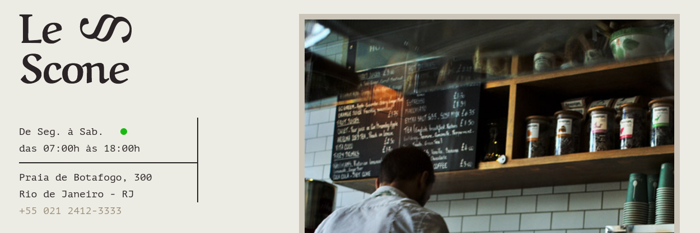
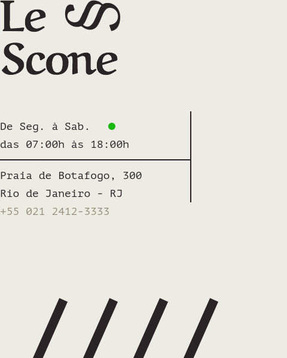
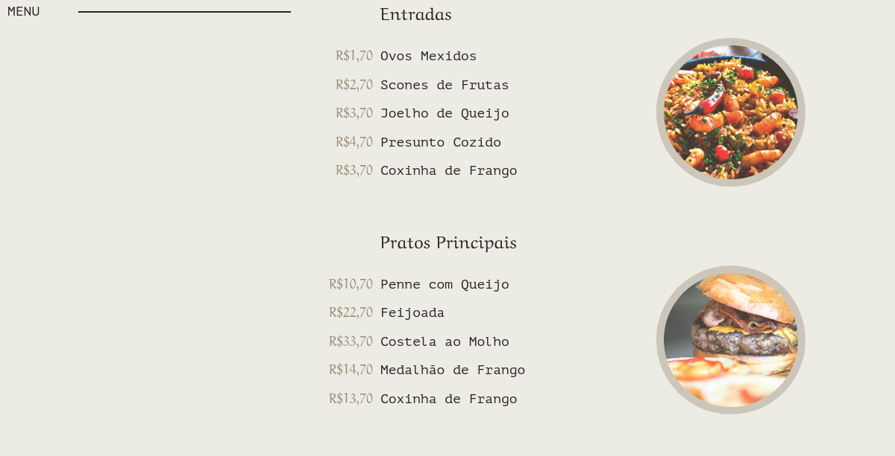
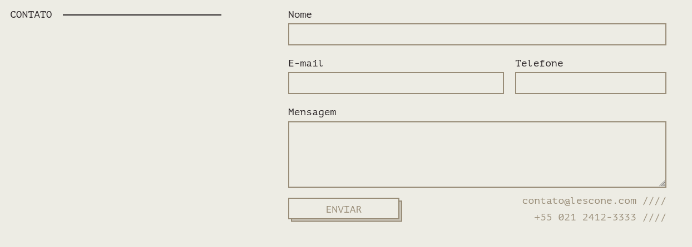

# :rocket: CSS com SASS

<p align="center">Projeto desenvolvido no curso CSS com SASS, ministrado pela <a href="https://github.com/origamid">Origamid</a>. Ele consiste em criar os estilos do website Bikecraft utilizando o pré-processador SASS.</p>

### :pushpin: Conteúdo

<p align="center">
	<a href="#pre-requisitos">Pré-requisitos</a> | 
	<a href="#deploy">Deploy</a> | 
	<a href="#funcionalidade">Funcionalidade</a> | 
	<a href="#screenshots">Screenshots</a> | 
</p>

### :gear: Pré-requisitos

Antes de começar, você vai precisar ter instalado em sua máquina as seguintes ferramentas:
[Git](https://git-scm.com), [Node.js](https://nodejs.org/en/). 
Além disto é bom ter um editor para trabalhar com o código como [VSCode](https://code.visualstudio.com/)

### :link: Deploy

<p>
	Para acessar o deploy da aplicação na plataforma da <a href="https://app.netlify.com/">Netlify</a>, visite
	<a href="https://murilojssilva-origamid-sass.netlify.app/">https://murilojssilva-origamid-sass.netlify.app/</a>
</p>

### :hammer: Funcionalidade

- [x] Utilizar o SASS


### :framed_picture: Screenshots

<p align="center">
	
</p>
<p align="center">
	
</p>
<p align="center">
	
</p>
<p align="center">
	
</p>

### :rocket: Executando a aplicação

#### Clone do repositório

```shell
$ git clone <https://github.com/murilojssilva/origamid-sass>
```

#### Utilize a extensão Live Server no VS Code para exibir a página


<h4 align="center">Feito com :black_heart: por <a href="https://github.com/murilojssilva">Murilo</a></h4>